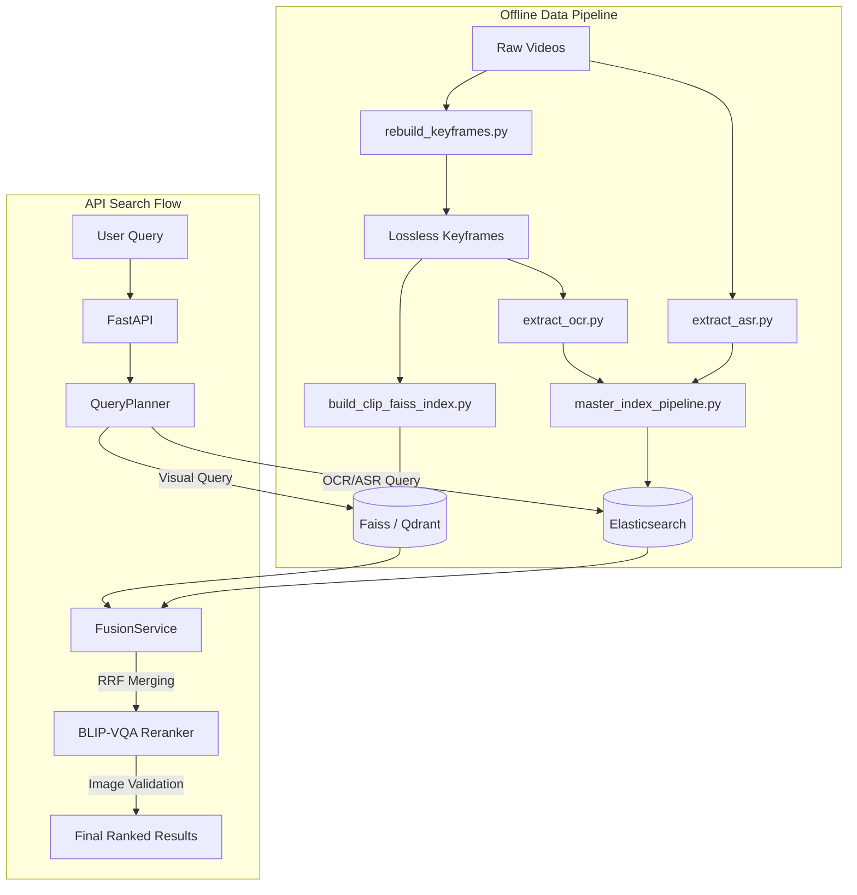

# AI Challenge 2025 - Multimodal Video Retrieval Backend

> **Note for AI Agents:** For AI agent guidance and detailed repository context, please refer to `skills/README.md`, `ARCHITECTURE_UPGRADE_PLAN.md`, and `AGENT_TASKS.md`.

This repository contains the backend system for an advanced image and video keyframe retrieval system. Built currently with **Flask** (with plans to migrate to FastAPI) and powered by **Faiss** and **OpenCLIP**, the system provides robust visual semantic retrieval, temporal sequence search, and Q&A search capabilities.

## 🚀 Features

- **Text-to-Image Search:** Retrieve video keyframes using natural language queries via CLIP embeddings.
- **Image-to-Image Search:** Find visually similar frames using a base image or Faiss ID.
- **Temporal Search (TRAKE):** Retrieve sequences of events in chronological order with temporal constraint scoring.
- **Q&A Search:** Combines retrieval with a VLM (Vision-Language Model) processor to answer questions about the retrieved frames.
- **Offline Indexing Pipeline:** Dedicated scripts to extract keyframes, encode with OpenCLIP (`ViT-H-14-quickgelu`), and build Faiss indices.

## 📁 Directory Structure

```text
Back-End/
├── app.py                     # Main Flask application entry point
├── main.py                    # FastAPI entry point (Phase 1 Migration)
├── config.py                  # Environment & Database Configurations
├── requirements.txt           # Python dependencies
├── scripts/                   # Data processing and indexing scripts
│   ├── build_clip_faiss_index.py
│   ├── rebuild_keyframes.py
│   └── verify_search_assets.py
├── src/                       
│   ├── api/                   # FastAPI Routers (WIP)
│   ├── controllers/           # Flask route controllers (user_controller.py)
│   ├── services/              # Business logic (user_service.py)
│   ├── utils/                 # Core AI utilities (Faiss, VLM, NLP, Temporal)
│   │   ├── faiss_processing.py
│   │   ├── trake_processing.py
│   │   ├── vlm_processing.py
│   │   └── nlp_processing.py
│   ├── data/                  # Root directory for generated data
│   │   ├── Keyframes/         # Extracted keyframe images (lossless WebP/JPG)
│   │   └── features/          # Per-video numpy features (.npy)
│   └── dict/                  # Metadata and indices
│       ├── metadata_clip.json
│       └── nw/
│           └── faiss_index_clip.bin
└── tests/                     # Unit tests
```

## 🏗️ Architecture & Pipeline



## ⚙️ Installation & Setup

### 1. Environment Setup (Windows/Linux)

It is highly recommended to use Conda to manage your environment to prevent dependency conflicts, especially with `faiss` and `torch`.

```bash
# Create and activate conda environment
conda create --name AIChallenge2025 python=3.10 -y
conda activate AIChallenge2025

# Install dependencies
pip install -r requirements.txt
```

*Note: Ensure you have compatible versions of `torch`, `torchvision`, and `faiss-cpu` (or `faiss-gpu`) for your system.*

### 2. Data Preparation

Before running the backend, you must build the local data assets. Ensure your source videos are placed in a reachable directory and map them properly.

**Step 1: Extract Keyframes**
Extracts keyframes from videos based on `metadata_clip.json` without losing resolution.
```bash
python scripts/rebuild_keyframes.py --video-root <path_to_your_videos_directory>
```

**Step 2: Build Faiss Index & Features**
Encodes the extracted keyframes using OpenCLIP and builds the `faiss_index_clip.bin` and `.npy` features.
```bash
python scripts/build_clip_faiss_index.py
```

**Step 3: Verify Assets**
Ensure everything was built correctly before starting the server.
```bash
python scripts/verify_search_assets.py
```

## 🏃‍♂️ Running the Server

Once the data pipeline is complete, you can start the backend server. The project has migrated to **FastAPI** as the primary API framework.

### Step 1: Start Elasticsearch
The backend now supports Multimodal Search (OCR/ASR). You must have Elasticsearch running locally.
- **Via Docker:** `docker run -d -p 9200:9200 -e "discovery.type=single-node" elasticsearch:8.15.0`
- **Via Windows Executable:** Run `elasticsearch.bat` in the Elasticsearch `bin` folder.

### Step 2: Start FastAPI
```bash
# Start the FastAPI server directly:
python main.py

# Alternatively, run via uvicorn with auto-reload for development:
uvicorn main:app --host 0.0.0.0 --port 8000 --reload
```
*Note: The server uses port 8000 by default (previously 5000 in Flask).*

The server will load environment variables and wait for API requests. Heavy AI models (Faiss, OpenCLIP, BLIP-VQA, SigLIP) are initialized **lazily**, meaning the server starts up instantly and only loads the models into RAM/VRAM when an endpoint is called for the first time.

### Step 3: Test via Swagger UI
FastAPI automatically generates an interactive API documentation interface.
- Open your browser and navigate to: **http://localhost:8000/docs**
- Click on `POST /users/multimodalsearch`.
- Click **"Try it out"**.
- Enter your search query in the Request Body (e.g., `{"query": "man riding a bicycle"}`) and click **Execute**.

## 🛣️ Architecture Upgrade Completed
The massive AI Challenge 2025 Architecture Upgrade is now **100% COMPLETED**:
- ✅ Migrated fully to **FastAPI** with strict Pydantic schemas.
- ✅ Integrated **Elasticsearch** for OCR and ASR multimodal retrieval.
- ✅ Implemented Adaptive Fusion and a rule-based Query Planner.
- ✅ Added BLIP-VQA Image Validation Reranking.
- ✅ Upgraded to Temporal Beam Search with exponential time-gap decay.
- ✅ Integrated Dual Embedding (SigLIP & BEiT-3) with Reciprocal Rank Fusion (RRF).
*(See `ARCHITECTURE_UPGRADE_PLAN.md` for full details).*
