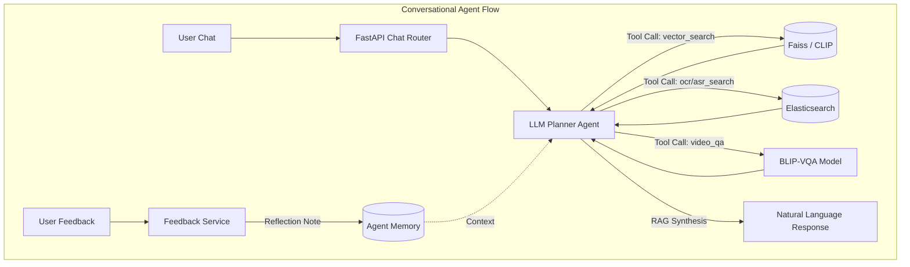

# AI Challenge 2026 - Agentic AI Multimodal Retrieval System

> **Note for AI Agents:** For competition rules, query types (Textual KIS, Q&A, TRAKE), and scoring mechanics ($R@k$), see [agent_prompts/aic_2026_competition_context.md](agent_prompts/aic_2026_competition_context.md). For agent tasks and architecture, see `ARCHITECTURE_UPGRADE_PLAN.md` and `AGENT_TASKS.md`.

This repository contains the backend system for an advanced multimodal image and video keyframe retrieval system. Built with **FastAPI** and powered by **Agentic AI** (LangChain, Gemini/OpenAI), **Faiss**, **OpenCLIP**, and **Elasticsearch**, the system provides robust visual semantic retrieval, temporal sequence search, and a fully conversational reasoning AI assistant.

## 🚀 Key Features

- **Conversational KIS (Agentic AI):** An intelligent LangChain-powered agent that maintains session memory, uses the Spatiotemporal Reasoning (STAR) framework to select search tools, and synthesizes natural language answers using RAG.
- **Text-to-Image Search:** Retrieve video keyframes using natural language queries via CLIP embeddings.
- **Image-to-Image Search:** Find visually similar frames using a base image or Faiss ID.
- **Multimodal Search:** Query text overlays (OCR) and speech/dialogue (ASR) powered by Elasticsearch.
- **Temporal Search (TRAKE):** Retrieve sequences of events in chronological order with temporal constraint scoring.
- **Q&A Search (VQA):** Combines retrieval with a VLM (Vision-Language Model) processor to answer detailed questions about retrieved frames.
- **Self-Reflective Feedback Loop:** The Agent learns from user feedback (Thumbs Up/Down) and injects reflection context into its memory for subsequent queries.

## 📁 Directory Structure

```text
Back-End/
├── main.py                    # FastAPI entry point
├── config.py                  # Environment & Database Configurations
├── requirements.txt           # Python dependencies
├── scripts/                   # Data processing and indexing scripts (data_extraction, indexing, etc.)
├── src/                       
│   ├── agent/                 # Agentic AI Core
│   │   ├── llm_planner.py     # LangChain Agent Executor & STAR Prompt
│   │   ├── memory_manager.py  # Session-based Chat History
│   │   └── tools.py           # LangChain Tool wrappers (Vector, OCR, ASR, Temporal, VQA)
│   ├── api/                   
│   │   └── routers/           # FastAPI Routers (chat_router.py, search_router.py)
│   ├── schemas/               # Pydantic validation models
│   ├── services/              # Business logic (user_service.py, feedback_service.py)
│   ├── utils/                 # Core utilities (Faiss, VLM, ElasticProcessor)
│   ├── data/                  # Root directory for generated data (Keyframes, features)
│   └── dict/                  # Metadata and indices (faiss_index_clip.bin)
└── tests/                     # Unit tests
```

## 🏗️ Architecture & Pipeline



## ⚙️ Installation & Setup

### 1. Environment Setup (Windows/Linux)

It is highly recommended to use Conda to manage your environment to prevent dependency conflicts, especially with `faiss` and `torch`.

```bash
# Create and activate conda environment
conda create --name AIChallenge2025 python=3.10 -y
conda activate AIChallenge2025

# Install dependencies
pip install -r requirements.txt
```

**GPU (optional but recommended for Jina CLIP v2):** bare `pip install torch` may
give the CPU-only wheel (notably on Windows), which makes Jina encoding ~10x
slower. On a machine with an NVIDIA GPU, install a CUDA build matching your
driver, e.g. `pip install torch==2.13.0+cu126 torchvision==0.28.0+cu126
--index-url https://download.pytorch.org/whl/cu126`. `JINA_DEVICE=auto` (the
default) then uses the GPU automatically.

### Check your Jina CLIP v2 setup

Run this any time to see if this machine has everything the Jina backend needs
(GPU-capable torch, the pinned `jinaai/jina-clip-v2` model snapshot, and the four
checksum-verified `jina_*` cloud artifacts) — no server required:

```bash
python scripts/check_jina_setup.py
```

It prints `[ OK ]` / `[MISS]` per item with the exact fix, and exits non-zero if
anything is missing.

### 2. Environment Variables (.env)

Create a `.env` file in the root directory. For the Agentic AI features to work, you must provide an API Key:

```env
# Choose one of the following LLM providers:
GOOGLE_API_KEY="your_gemini_api_key"
OPENAI_API_KEY="your_openai_api_key"

# Other configurations...
```

### 3. Data Preparation

Before running the backend, you must build the local data assets. Ensure your source videos are placed in a reachable directory.

1. **Extract Keyframes:** `python scripts/data_extraction/rebuild_keyframes.py`
2. **Build Faiss Index:** `python scripts/indexing/build_clip_faiss_index.py`
3. **Index Elasticsearch:** Ensure Elasticsearch is running, then bulk insert OCR/ASR data.

#### Video playback / frame capture assets

The `/users/videos/{video_id}/playback` and `/users/videos/{video_id}/capture`
endpoints need two per-video assets:

| Asset | Env var | Default |
| --- | --- | --- |
| `media-info` (YouTube `watch_url` + `length`) | `MEDIA_INFO_PATH` | `media-info-aic25-b1.zip` at repo root, then `src/dict/media-info/` |
| `map-keyframes` (authoritative FPS) | `MAP_KEYFRAMES_PATH` | `src/dict/map-keyframes/`, then existing `src/dict/map-keyframes.zip` |

`media-info-aic25-b1.zip` is a large runtime asset and is **git-ignored** —
copy it onto the machine (or set `MEDIA_INFO_PATH` to wherever it lives). Both
values accept either a ZIP archive or an extracted directory, with or without a
wrapping top-level folder.

The YouTube timeline is assumed to be aligned with the dataset timeline, so the
playback offset defaults to `0` for every video. If a specific video is
verified to be shifted, add it to `PLAYBACK_OFFSETS_JSON`, e.g.
`PLAYBACK_OFFSETS_JSON={"L21_V029": -172}` (`source_time = playback_time - offset`).

#### Captured-frame previews (optional)

On success, `POST /users/videos/{video_id}/capture` also tries to attach an
**exact** still for the submitted frame (`preview_url`), extracted from the
YouTube `watch_url` in `media-info`. This needs:

* the `yt-dlp` Python dependency (in `requirements.txt`), and an **FFmpeg
  binary** on `PATH` (or set `VIDEO_CAPTURE_FFMPEG_BIN` to its path);
* **outbound network access to YouTube** from the server.

Only the generated WebP is stored, under `.cache/video-captures/<video_id>/<frame_idx>.webp`
(`VIDEO_CAPTURE_CACHE_PATH`); repeated captures reuse it and least-recently-used
stills are evicted once the cache passes `VIDEO_CAPTURE_CACHE_MAX_BYTES`
(500 MB default). `VIDEO_CAPTURE_EXTRACT_TIMEOUT_SECONDS` (90s) bounds one
extraction. All of this is optional — when the tools, network, or source video
are unavailable the frame index is still returned and remains exportable, just
with `preview_url: null` and a `preview_error` reason; app startup is unaffected.

## 🏃‍♂️ Running the Server

### Recommended: the local launcher

```bash
python -m launcher            # backend + frontend (frontend on by default)
python -m launcher --no-frontend
```

The launcher reads the **active runtime-config revision**, starts the FastAPI
backend, and watches for restart requests from the Settings UI. On a config
change it applies the new revision, polls `/health`, and — if the app does not
come up healthy within `LAUNCHER_HEALTH_TIMEOUT_SECONDS` — automatically
restores the previous revision and starts again.

It also starts the local frontend (`LAUNCHER_FRONTEND_ENABLED=true` by
default). `LAUNCHER_FRONTEND_MODE=preview` (default) runs `npm run build` — only
when `frontend/dist` is missing / stale or `HOST`/`PORT` changed — and serves
the bundle with `vite preview`; `LAUNCHER_FRONTEND_MODE=dev` runs the
hot-reload dev server instead. A missing or broken npm toolchain is **non-fatal**:
the launcher logs a warning and the backend still comes up. When `HOST`/`PORT`
change the frontend is rebuilt/restarted with the new API base URL.

Runtime configuration lives in a per-user SQLite store
(`<app-data>/HCMAI2026/config.db`), seeded from `.env` on first run. After that,
edit configuration through the loopback-only Settings API / UI
(`/settings/...`), not `.env`. Set `HCMAI_DISABLE_CONFIG_STORE=1` to fall back
to pure `.env` behaviour.

### Manual (no launcher)

#### Step 1: Start Elasticsearch
- **Via Docker:** `docker run -d -p 9200:9200 -e "discovery.type=single-node" elasticsearch:8.15.0`

#### Step 2: Start FastAPI
```bash
uvicorn main:app --host 0.0.0.0 --port 8000 --reload
```

*Note: The server uses port 8000 if you run via uvicorn with the `--port 8000` flag, or port 3000 by default if you just run `python main.py`.*

### Step 3: Test via Swagger UI
- Open your browser and navigate to: **http://localhost:8000/docs** (hoặc port 3000 tùy cách chạy)
- Use the **`/chat/conversational_kis`** endpoint to chat with the Agent.
- Use the **`/chat/feedback`** endpoint to send reflections to the Agent's memory.

## 🛣️ Agentic AI Upgrade Completed
The system has been successfully upgraded to an **Agentic AI Architecture**:
- ✅ **Phase 1:** Integrated LangChain Memory & Chat Interface.
- ✅ **Phase 2:** Refactored core search functions into LangChain `@tool` definitions.
- ✅ **Phase 3:** Implemented Spatiotemporal Reasoning (STAR) and RAG Synthesis via LLM Prompts.
- ✅ **Phase 4:** Established a Self-Reflective Feedback loop for continuous accuracy improvement.
- ✅ **Performance:** Wrapped agent tool executions in `asyncio.to_thread` to prevent FastAPI event loop blocking.
