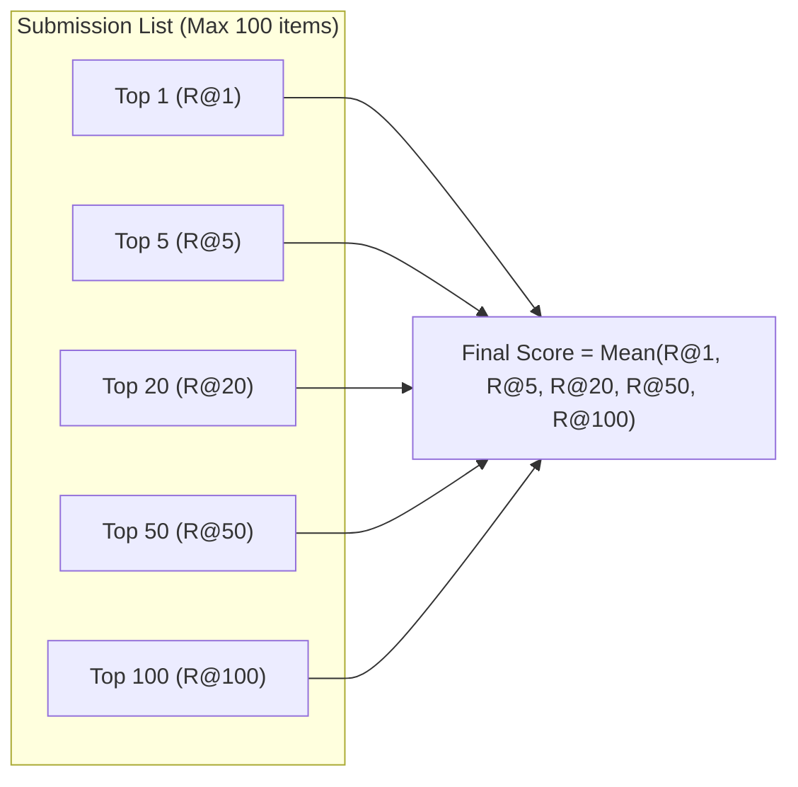

# AIC 2026 Competition Context & Domain Reference for AI Agents

> **Context**: Ho Chi Minh City AI Challenge 2026 (AIC 2026) — Preliminary Round (Vòng Sơ Tuyển)  
> **Target Audience**: AI Agents, LLM Query Planners, Search Pipelines, and Human Developers.

---

## 1. Overview of Query Types (Nội Dung Các Loại Truy Vấn)

The preliminary competition evaluates video retrieval systems across **three distinct query paradigms**:

### 🔹 Type 1: Textual Known-Item Search (Textual KIS)
* **Description**: The query is a complete natural language description describing a specific event or visual scene in the video collection.
* **Goal**: Identify the exact video segment containing the described event.
* **Submission Requirement**: Submit **at least one keyframe ID** (or timestamp) falling within the ground-truth video segment interval.
* **Agent Strategy**:
  * Utilize dense visual-semantic retrieval (e.g., **BEiT-3**, **OpenCLIP** ViT-H/14).
  * Combine with OCR / ASR text filtering when specific text or spoken keywords are mentioned in the query.
  * Rank high-confidence visual matches at the top of the 100-item submission list.

---

### 🔹 Type 2: Video Question-Answering (Q&A)
* **Description**: The query consists of two components:
  1. A natural language **event description** (context/anchor).
  2. A **specific question** about that event or scene.
* **Goal**:
  1. Localize the relevant moment / keyframe in the video collection.
  2. Produce a concise, accurate text answer (in **Vietnamese** or **English** as requested).
* **Submission Requirement**: Submit the target `(video_id, keyframe_id)` pair **along with the semantic text answer**.
* **Agent Strategy**:
  * **Step 1 (Localization)**: Run Textual Retrieval using the event description to retrieve candidate keyframes.
  * **Step 2 (VQA / Multimodal Verification)**: Pass candidate keyframes and the question to a Multimodal LLM (e.g., Gemini 2.5 Flash / GPT-4o / BLIP-2) to extract/verify the text answer.
  * **Step 3 (Formatting)**: Return `(video_id, frame_id, answer_text)`.

---

### 🔹 Type 3: Temporal Retrieval and Alignment of Keyframe Events (TRAKE)
* **Description**: A multi-event temporal narrative describing a sequential progression of actions (e.g., Event 1 $\rightarrow$ Event 2 $\rightarrow$ Event 3) within a single video.
* **Goal**: A two-phase hierarchical task:
  * **Phase 1 (Video Retrieval)**: Identify the **single video** that best matches the entire event sequence across the corpus.
  * **Phase 2 (Temporal Semantic Alignment)**: For that specific video, identify **one unique semantic keyframe** for each stage in the event sequence, preserving temporal order.
* **Submission Requirement**: Submit the chosen `video_id` accompanied by an ordered list of keyframe IDs: `[keyframe_event_1, keyframe_event_2, ..., keyframe_event_N]`.
* **Agent Strategy**:
  * Run individual vector searches for each event sub-query.
  * Aggregate scores per video ID with chronological consistency penalties (e.g., TraKe beam search or dynamic time warping).
  * Select the top consensus video, then extract the best monotonic keyframe sequence $(t_1 < t_2 < \dots < t_N)$.

---

## 2. Evaluation Metric & Scoring Formulation (Phương Pháp Tính Điểm)

### Submission Constraints
* Maximum **100 candidate answers** per query: $\{a_1, a_2, \dots, a_{100}\}$.

### Relevance Score ($R\text{-Score} \in [0, 1]$)

| Query Type | Condition for $R\text{-Score} = 1.0$ | Failure Condition ($R\text{-Score} = 0.0$) |
| :--- | :--- | :--- |
| **Textual KIS** | $\text{Video ID} = \text{GT Video ID}$ **AND** $\text{Keyframe} \in [\text{Start}_{\text{GT}}, \text{End}_{\text{GT}}]$ | Wrong Video ID or Keyframe outside GT interval |
| **Q&A** | $\text{Video ID}$ match **AND** $\text{Keyframe}$ in GT interval **AND** Answer text semantically matches GT | Any condition fails |
| **TRAKE** | $\text{Video ID} = \text{GT Video ID}$. Score is proportional to matched events: $\frac{\text{Matched Events}}{\text{Total Events}}$ | Wrong Video ID gives **0 points immediately** |

---

### Final Score Calculation (Điểm Cuối Cùng)

The final score for each query is the average of **Recall@k ($R@k$)** at 5 discrete rank cutoffs:

$$\text{Final Score} = \frac{1}{5} \sum_{k \in \{1, 5, 20, 50, 100\}} R@k$$

where:
* $R@k = \max_{1 \le i \le k} R\text{-Score}(a_i)$ is the maximum relevance score among the **top $k$** submitted candidates.



> [!IMPORTANT]
> **Strategic Implication for AI Agents**:
> * A correct answer placed at **Rank 1** contributes to **all 5 cutoffs** ($R@1, R@5, R@20, R@50, R@100$), yielding a perfect score of **1.0**.
> * A correct answer placed at **Rank 6** only contributes to $R@20, R@50, R@100$, yielding only $\frac{3}{5} = \mathbf{0.6}$.
> * A correct answer placed at **Rank 55** only contributes to $R@100$, yielding $\frac{1}{5} = \mathbf{0.2}$.
> * **Conclusion**: **Early precision & aggressive re-ranking** of the top 5 results are the single highest leverage factor for winning.

---

## 3. Dataset Architecture & Artifacts (Thông Tin Dữ Liệu)

### Batch 1 (Warmup / Historical Baseline)
* **Videos**: Raw source video files (MP4 format).
* **Keyframes**: Extracted representative frames (`.jpg` / `.webp`) stored in hierarchical directories (`keyframes/{video_id}/{n}.jpg`).
* **Object Detections**: JSON files detailing detected bounding boxes and class labels from Faster R-CNN models.
* **Feature Embeddings**:
  * Base: `clip-ViT-B-32` features stored in `.npy` files.
  * Enhanced: **BEiT-3** 1024-dim multimodal vector index (`beit3_faiss.index`, 286,629 vectors).
* **Metadata**: YouTube metadata (video title, channel, description, tags, duration).
* **Map-Keyframes**: CSV mapping files (`src/dict/map-keyframes/{video_id}.csv`) providing frame index $\leftrightarrow$ keyframe file $\leftrightarrow$ timestamp conversions.

### Batch 2 (Upcoming Official Preliminary Release)
* Additional video batches and ground-truth sets to be integrated prior to the official preliminary round.

---

## 4. Pipeline & Agent Action Matrix

```
                      ┌───────────────────────────────────────────────┐
                      │              User Query Input                 │
                      └──────────────────────┬────────────────────────┘
                                             │
                                   [Query Type Classifier]
                                             │
             ┌───────────────────────────────┼───────────────────────────────┐
             │                               │                               │
             ▼                               ▼                               ▼
    [Type 1: Textual KIS]            [Type 2: Video Q&A]            [Type 3: TRAKE]
             │                               │                               │
    • BEiT-3 Vector Search          • Extract Visual Context        • Decompose sub-events
    • OCR/ASR Elasticsearch         • BEiT-3 Retrieval              • Multi-event FAISS Search
    • Score Fusion (RRF)            • VQA LLM (Gemini/GPT-4o)       • Consensus Video Vote
    • Rank & Deduplicate            • Format (Video, Frame, Ans)    • Monotonic Temporal Align
             │                               │                               │
             └───────────────────────────────┼───────────────────────────────┘
                                             │
                                   [Top-100 Formatter]
                                             │
                                 [Export AIC Submission]
```

### Critical Implementation Guidelines for Agents
1. **Timestamp / Frame Conversion**: Always resolve `vector_id` $\rightarrow$ `frame_id` $\rightarrow$ `frame_idx` using `map-keyframes/{video_id}.csv` to ensure submission matches exact evaluation format.
2. **Query Translation / Expansion**: Support both Vietnamese and English queries. Automatically translate or expand domain terms (e.g., *"áo dài"*, *"xe máy"*, *"cảnh sát giao thông"*).
3. **Multimodal Synergy**: Whenever a query contains text keywords (numbers, store names, TV channel names), prioritize Elasticsearch OCR scores over pure visual vectors.
